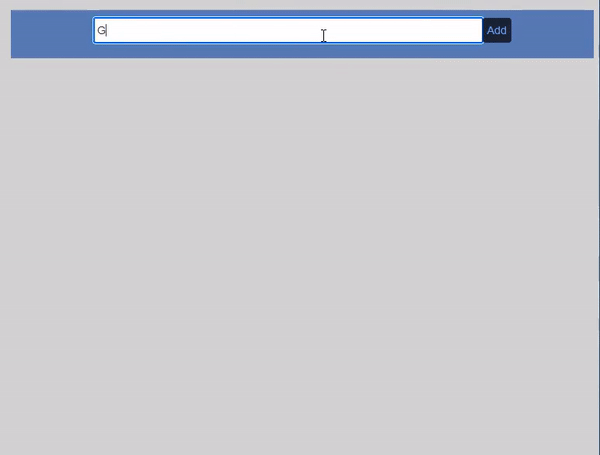

# ToDo List
A dynamic and simple ToDo List.

## Description
With this app, you can add new tasks pending to be done, and whed it have been done, you can checked, and it won't be there anymore.
## How to Run

#### InSite

Just go to this link:
[https://ziurn.github.io/JefersonMITxProReactToDoList/](https://ziurn.github.io/JefersonMITxProReactToDoList/)

#### Download this repository.
Just clone or download this repository, and open the <code>index.html</code> file on your favorite web browser.

## Roadmap
There are some feature will be introduced in the future.
* Storage the tasks in a Database.
* Some kind of notification and due time.
* Tasks classification.

## License information
This code is under MIT licence, you can find the complete file [here](https://github.com/ZiurN/JefersonMITxPROEyeMovement/blob/main/LICENSE)